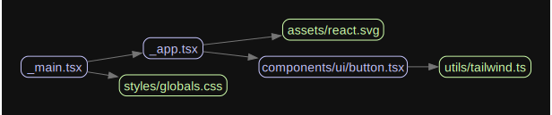

# Vite Boilerplate

## Features

- [Vite](https://vitejs.dev/) - Next generation frontend tooling.
- [TypeScript](https://www.typescriptlang.org/) - A strongly typed programming language that builds on JavaScript.
- [Tailwind CSS](https://tailwindcss.com/) - A utility-first CSS framework for rapidly building modern websites.
- [shadcn/ui](https://ui.shadcn.com/) - Beautifully designed components that you can copy and paste into your apps.
- [TanStack Query](https://tanstack.com/query/latest) - A powerful asynchronous state management for React.
- [Zod](https://zod.dev/) - A TypeScript-first schema declaration and validation library.
- [Lucide React](https://lucide.dev/guide/packages/lucide-react) - Beautiful & consistent icon toolkit.
- [ESlint](https://eslint.org/) - ESLint statically analyzes your code to quickly find problems.
- [Prettier](https://prettier.io/) - An opinionated code formatter.
- [Plop](https://plopjs.com/) - Generate new files with consistency.
- [Bundle Analyzer](https://github.com/btd/rollup-plugin-visualizer) - Visualize and analyze your Rollup bundle.
- [Vitest](https://vitest.dev/) - For fast unit test.
- [React Testing Library](https://testing-library.com/docs/react-testing-library/intro/) - For UI testing with realistic event simulation.
- [GitHub Actions](https://github.com/features/actions) - Pre-configured workflows for CI/CD.
- [Madge](https://github.com/pahen/madge) - A tool for generating a visual graph of your module dependencies, finding circular dependencies.

## Scripts

The following scripts are available in the `package.json`.

- `dev`: Starts the development server
- `build`: Builds the app for production
- `lint`: Lints the code
- `preview`: Locally preview the production build
- `typecheck`: Checks types
- `test`: Runs unit tests
- `test:ui`: Runs UI tests
- `coverage`: Generates code coverage
- `create:model`: Generates `model`, `schema`, `query` files
- `analyze`: Analyzes the bundle sizes
- `graph`: Generates dependency graph image

## Dependency graph

To generate dependency graph image Graphviz is required.

1. Install Graphviz

```sh
brew install graphviz
```

2. Run command

```sh
npm run graph
```

This will create a `graph.svg` file in root.


